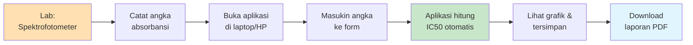
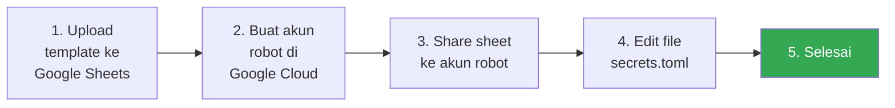
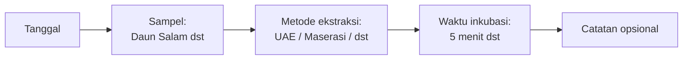

<!-- markdownlint-disable MD033 MD041 -->

# Panduan Pengguna

**Cara pakai Platform Digital Evaluasi Antioksidan Daun Salam**

*untuk peneliti, asisten lab, dan mahasiswa — tidak butuh latar belakang programming.*

---

## Daftar Isi

1. [Apa Sih Platform Ini?](#apa-sih-platform-ini)
2. [Tampilan Aplikasi](#tampilan-aplikasi)
3. [Pertama Kali Pakai](#pertama-kali-pakai)
4. [Input Data Hasil Lab](#input-data-hasil-lab)
5. [Lihat & Bandingkan Hasil](#lihat--bandingkan-hasil)
6. [Edit atau Hapus Data Salah](#edit-atau-hapus-data-salah)
7. [Uji Statistik (ANOVA) — Buat Pembimbing](#uji-statistik-anova--buat-pembimbing)
8. [Print Laporan PDF Buat Lampiran Tesis](#print-laporan-pdf-buat-lampiran-tesis)
9. [Kalau Ada Modul Tambahan: UAE & TPC](#kalau-ada-modul-tambahan-uae--tpc)
10. [Pertanyaan yang Sering Ditanya (FAQ)](#pertanyaan-yang-sering-ditanya-faq)
11. [Glosarium](#glosarium)

---

## Apa Sih Platform Ini?

Bayangin lo abis ngukur **absorbansi DPPH** di lab pakai spektrofotometer.
Biasanya hasilnya dimasukin manual ke Excel, terus hitung satu-satu pakai
rumus, terus bikin grafik, terus dihitung IC50-nya. Repot banget kan?

**Platform ini ngerjain semua itu otomatis.** Tinggal masukin angka
absorbansi, sisanya:

- **% Inhibisi** dihitung otomatis (3 replikasi)
- **Rata-rata, SD, IC50** langsung muncul
- **Grafik** ke-bikin sendiri
- **Data tersimpan** di Google Sheets (bisa diakses dari mana aja)
- **Laporan PDF** buat lampiran tesis bisa di-download
- **Uji statistik (ANOVA)** udah siap kalau pembimbing minta

### Alur Sederhana

---

## Tampilan Aplikasi

Setelah aplikasi jalan, di sidebar kiri ada **6 halaman**:

| Halaman | Fungsi | Kapan Dipakai |
|---|---|---|
| **Home** | Dashboard ringkasan | Pertama kali buka, lihat IC50 terbaik |
| **Input DPPH** | Masukin data baru | Setiap selesai pengukuran lab |
| **Visualisasi DPPH** | Lihat grafik & tabel | Bikin chart buat presentasi/tesis |
| **Riwayat Data** | Edit/hapus data | Kalau salah ketik atau mau koreksi |
| **Input UAE** | Catat parameter ekstraksi | Saat optimasi metode UAE |
| **Input TPC** | Catat total fenolik | Saat uji TPC |
| **Analisis ANOVA** | Uji beda nyata | Kalau pembimbing minta statistik |

---

## Pertama Kali Pakai

### Cara 1: Coba Dulu Tanpa Setup (Paling Cepat)

Aplikasi punya **mode lokal** — semua data otomatis disimpan di laptop lo.
Cocok buat lo yang baru mau coba-coba.

1. Minta tim teknis (yang setup aplikasi) buat ngasih file aplikasi
2. Buka link aplikasi yang udah jadi (kalau udah di-deploy) atau jalanin lokal
3. Banner di Home akan tertulis: **"Backend penyimpanan: CSV Lokal"**
4. Lo bisa langsung input data, semua aman tersimpan di komputer

> ⚠️ **Catatan:** Mode lokal artinya data cuma ada di laptop yang dipakai.
> Kalau pakai laptop lain atau di-refresh halaman web, data yang sama gak
> bakal kelihatan. Buat riset serius, pakai mode Google Sheets di bawah.

### Cara 2: Pakai Google Sheets (RECOMMENDED Buat Riset)

Dengan Google Sheets, data lo:

- Bisa diakses dari **HP, laptop kantor, laptop lab**, dst
- Otomatis ke-backup di Google
- Bisa dibuka langsung di Google Sheets buat audit/print
- Aman walaupun aplikasi-nya di-restart

**Setup awal pakai 2 cara:**

#### Opsi A: Minta Tim Teknis Setup

Paling gampang. Tim teknis (atau pembimbing IT) yang ngerjain bagian
teknis (Google Cloud, service account, secrets.toml). Tugas lo cuma:

1. Minta dikirim **link aplikasi** yang udah jadi (mis. `https://daun-salam.streamlit.app`)
2. Minta **passcode login** (kalau auth diaktifkan)
3. Buka link, login, mulai input

#### Opsi B: Setup Sendiri (Pakai Template)

Kalau lo mau setup sendiri, total ~10 menit. Singkatnya:

**Yang lo butuhin:**

- File `template_gsheet.xlsx` (di repo)
- Akun Google
- Notepad / VS Code

**Langkah singkat:**

1. **Upload template:** buka Google Sheets baru → File → Import → Upload `template_gsheet.xlsx` → Replace spreadsheet
2. **Bikin "akun robot":** buka <https://console.cloud.google.com> → New Project → Enable Sheets API & Drive API → Create Service Account → Add Key (JSON) → download
3. **Share sheet:** buka file JSON → copy `client_email` → paste di tombol Share Google Sheet → set Editor
4. **Edit secrets:** copy isi JSON ke file `app/.streamlit/secrets.toml` (format ada di README)
5. **Restart app** → banner berubah jadi "Backend: Google Sheets"

Untuk panduan visual lengkap step-by-step (dengan tabel langkah, screenshot
location), buka [README.md → Setup Google Sheets](README.md#setup-google-sheets).

#### 💡 Bonus: Tab KALKULATOR (Quick Check Tanpa Buka App)

Setelah upload template, ada tab khusus bernama **`KALKULATOR`** di Google Sheets lo.

**Cara pakai:**

1. Buka tab **KALKULATOR**
2. **Edit cell warna kuning** — itu untuk input absorbansi (3 replikasi × 6 konsentrasi) + metadata
3. Cell **warna hijau** otomatis ke-update — % inhibisi, mean, SD
4. Cell **kuning tua** = hasil utama: **IC50** dan **Kategori antioksidan**

| Warna Cell | Boleh Edit? | Isi |
|---|:---:|---|
| 🟡 Kuning | ✅ Ya | Absorbansi (Abs 1, Abs 2, Abs 3), konsentrasi, metadata |
| 🟢 Hijau muda | ❌ Tidak (formula) | Abs mean, % inhibisi 1/2/3, mean, SD |
| ⚪ Abu | ❌ Tidak | Blanko (konsentrasi 0 ppm) — % inhibisi tidak dihitung |
| 🟨 Kuning tua | ❌ Tidak (formula) | **IC50 (ppm)** dan **Kategori** |

**Kapan dipakai:**

- Lagi di lab, gak sempet buka aplikasi Streamlit
- Mau cross-check hasil aplikasi
- Mau coba-coba "kalau absorbansi-nya beda dikit, IC50-nya jadi berapa?"

> ⚠️ Catatan: tab KALKULATOR cuma untuk quick check. Hasilnya **tidak otomatis
> tersimpan** ke tab DPPH. Kalau mau permanen, copy-paste manual ke tab
> DPPH atau pakai aplikasi Streamlit (yang otomatis simpan).

---

## Input Data Hasil Lab

Skenario: lo baru selesai ngukur absorbansi DPPH dengan 5 menit waktu inkubasi.

### Step 1: Buka Halaman "Input DPPH"

Klik **Input DPPH** di sidebar kiri.

### Step 2: Isi Metadata Percobaan

| Field | Contoh isian |
|---|---|
| Tanggal | tanggal pengukuran |
| Sampel | "Ekstrak Etanol Daun Salam" |
| Metode ekstraksi | UAE (kalau pakai sonikasi) |
| Waktu inkubasi (menit) | 5, 6, 7, 8, atau 9 |
| Catatan | bebas, mis. "etanol 70%, sonikasi 30 menit" |

### Step 3: Masukin Absorbansi

Tabel default sudah ada 6 baris (konsentrasi 0, 20, 40, 60, 80, 100 ppm).
Tinggal **klik tiap sel dan ketik angka absorbansi** dari spektrofotometer.

| Konsentrasi (ppm) | Abs 1 | Abs 2 | Abs 3 |
|---:|---:|---:|---:|
| 0 (blanko) | 0.667 | 0.669 | 0.671 |
| 20 | 0.469 | 0.464 | 0.465 |
| 40 | 0.399 | 0.398 | 0.392 |
| 60 | 0.268 | 0.267 | 0.267 |
| 80 | 0.141 | 0.142 | 0.142 |
| 100 | 0.051 | 0.053 | 0.055 |

> 💡 **Penting:** Konsentrasi **0 ppm = blanko** (DPPH + pelarut, tanpa
> sampel). Wajib diisi karena buat hitung % inhibisi.

### Step 4: Klik "Hitung Preview"

Aplikasi langsung tampilin:

- **IC50** (mis. 47.11 ppm)
- **Kategori** (mis. "Sangat kuat")
- **R-squared** (mis. 0.9913 — semakin dekat ke 1.0, semakin bagus)
- **Persamaan regresi** (mis. `y = 0.8077 x + 11.9482`)
- **Tabel detail** % inhibisi per konsentrasi
- **Grafik kurva regresi** dengan garis IC50

### Step 5: Klik "Simpan"

Kalau hasil preview kelihatan oke, klik tombol **Simpan**. Data langsung
masuk ke Google Sheets (atau CSV lokal).

> 🎉 Selesai! Datanya tersimpan permanen, bisa dilihat lagi kapan aja di
> halaman Visualisasi atau Riwayat.

---

## Lihat & Bandingkan Hasil

### Halaman "Visualisasi DPPH"

Halaman ini buat **lihat grafik & bandingin** beberapa percobaan.

**Yang bisa lo lakuin:**

1. **Filter** di sidebar — pilih sampel, metode, atau waktu inkubasi tertentu
2. **Tabel ringkasan IC50** — semua percobaan, di-sort dari IC50 terkecil
3. **Pilih percobaan tertentu** dari dropdown untuk lihat detail
4. **Tab "Kurva regresi"** — kurva linear dengan annotation IC50
5. **Tab "Bar chart"** — bar % inhibisi per konsentrasi dengan error bar
6. **Perbandingan IC50 antar waktu inkubasi** — line chart, langsung
   keliatan waktu mana yang IC50-nya paling rendah (terbaik)
7. **Download data CSV** — buat olah lebih lanjut di Excel
8. **Generate Laporan PDF** — buat lampiran tesis (lihat [section PDF](#print-laporan-pdf-buat-lampiran-tesis))

> 💡 **Tips Buat Skripsi/Tesis:** Screenshot grafik di tab "Kurva regresi"
> langsung bisa dipakai. Resolusi udah cukup tinggi buat dicetak.

---

## Edit atau Hapus Data Salah

Skenario: lo salah ketik absorbansi pas input.

### Halaman "Riwayat Data"

> 🔒 Kalau auth diaktifkan, lo perlu login dulu di sidebar.

**Edit:**

1. Tabel di tengah halaman langsung bisa di-edit (klik sel, ketik nilai baru)
2. Bisa tambah baris baru atau hapus baris dari ikon di pojok kanan atas tabel
3. Klik **Simpan perubahan** → langsung ter-update di Google Sheets

**Hapus 1 percobaan utuh:**

1. Pilih `experiment_id` dari dropdown (mis. `EXP_2026-01-15_5min_xxx`)
2. Klik **Hapus**
3. Semua 6 baris untuk percobaan itu (konsentrasi 0–100 ppm) terhapus
   sekaligus

> ⚠️ **Hati-hati:** Hapus = hilang permanen. Kalau ragu, edit aja dulu.

---

## Uji Statistik (ANOVA) — Buat Pembimbing

Kalau pembimbing minta:

> "Coba uji apakah waktu inkubasi 5 menit beda nyata sama waktu 6 menit."

Inilah jawabannya. Buka halaman **Analisis ANOVA**.

### Step 1: Pilih Apa yang Mau Dibandingkan

| Pilihan Metrik | Kapan Dipakai |
|---|---|
| **IC50 per percobaan** | Bandingin "kekuatan antioksidan" antar grup (paling umum) |
| **% Inhibisi pada konsentrasi tertentu** | Detail per replikasi, fokus 1 konsentrasi |

### Step 2: Pilih Variabel Pengelompok

| Variabel | Contoh Skenario |
|---|---|
| **Waktu inkubasi** | "Apa beda nyata antar waktu 5/6/7/8/9 menit?" |
| **Metode ekstraksi** | "Apa UAE beda nyata sama maserasi?" |
| **Sampel** | "Apa daun salam vs daun jambu beda nyata?" |

### Step 3: Lihat Hasil

Aplikasi langsung tampilin:

1. **Tabel statistik deskriptif** — n, rata-rata, SD per grup
2. **Boxplot** — visualisasi sebaran
3. **Hasil ANOVA** — F-statistic, p-value, plus interpretasi otomatis:

   > **Contoh hasil:** "Terdapat perbedaan yang signifikan secara statistik
   > antar grup (p = 0.0003 < 0.05). Lanjut ke uji post-hoc Tukey HSD untuk
   > mengetahui pasangan grup mana yang berbeda."

4. **Tabel Tukey HSD** — pasangan grup yang berbeda nyata
   (yang `reject = True`)
5. **Download CSV** — bisa di-paste ke skripsi/tesis

> 💡 **Buat Pembimbing:** Bilang "alpha 0.05" atau "tingkat kepercayaan 95%".
> Kalau p-value < 0.05 → ada beda nyata. Kalau ≥ 0.05 → tidak ada beda nyata.

---

## Print Laporan PDF Buat Lampiran Tesis

Skenario: pembimbing minta lampiran detail per percobaan.

### Cara

1. Buka halaman **Visualisasi DPPH**
2. Pilih `experiment_id` yang mau di-print
3. Scroll ke bawah, klik **Generate Laporan PDF**
4. Tunggu 5–10 detik (lagi render grafiknya)
5. Klik **Download PDF siap pakai**

### Isi PDF (A4, 2 Halaman)

**Halaman 1:**

- Judul laporan
- Tabel metadata (experiment_id, tanggal, sampel, metode, waktu, IC50, kategori, R², persamaan, catatan)
- Tabel detail data (konsentrasi, abs 1/2/3, mean, % inhibisi 1/2/3, mean, SD)

**Halaman 2:**

- Kurva regresi linear (high-res)
- Kesimpulan dengan kalimat siap kutip:

  > "Sampel **Ekstrak Etanol Daun Salam** menunjukkan nilai **IC50 = 47.11
  > ppm** dengan kategori **Sangat kuat** (Molyneux, 2004) pada waktu
  > inkubasi 5 menit..."

> 💡 **Tips:** Kalau perlu 5 lampiran (waktu 5/6/7/8/9 menit), generate
> bergantian dari tiap experiment_id. File-nya otomatis dinamai
> `laporan_EXP_xxx.pdf`.

---

## Kalau Ada Modul Tambahan: UAE & TPC

Dua modul ini **placeholder** — siap dipakai kalau riset lo perlu nyimpen
data ekstraksi atau total fenolik juga.

### Halaman "Input UAE" (Ultrasound-Assisted Extraction)

Buat catat parameter ekstraksi:

- Massa simplisia (g)
- Volume pelarut (mL)
- Jenis pelarut (Etanol 70%, Etanol 96%, Metanol, Air)
- Rasio pelarut
- Amplitudo (%)
- Frekuensi (kHz)
- Suhu (°C)
- Waktu sonikasi (menit)
- Siklus on/off
- Massa ekstrak hasil (g) → otomatis hitung **rendemen (%)**

### Halaman "Input TPC" (Total Phenolic Content)

Buat catat hasil pengukuran fenolik dengan metode Folin-Ciocalteu:

- Konsentrasi sampel (ppm)
- Absorbansi (3 replikasi)
- TPC (mg GAE/g) — diisi dari hasil interpolasi kurva standar GAE

---

## Pertanyaan yang Sering Ditanya (FAQ)

<b>Kenapa konsentrasi 0 ppm wajib diisi?</b>

Konsentrasi 0 ppm = **blanko** (DPPH + pelarut tanpa sampel). Absorbansinya
dipakai sebagai pembanding di rumus % inhibisi. Tanpa blanko, IC50 tidak
bisa dihitung.

<b>Berapa replikasi minimum?</b>

Aplikasi mengasumsikan **3 replikasi** (Abs 1, Abs 2, Abs 3) per
konsentrasi. Ini standar di kebanyakan jurnal. Kalau replikasi < 3, SD
tidak bisa dihitung dengan benar.

<b>Apa beda "Sangat kuat" vs "Kuat"?</b>

Klasifikasi berdasarkan IC50 (acuan: Molyneux 2004):

| IC50 (ppm) | Kategori |
|---:|---|
| < 50 | Sangat kuat |
| 50 – 100 | Kuat |
| 100 – 150 | Sedang |
| 150 – 200 | Lemah |
| > 200 | Sangat lemah |

Semakin **kecil** IC50, semakin **kuat** antioksidannya (artinya cuma
butuh sedikit konsentrasi buat menetralkan 50% radikal DPPH).

<b>R-squared yang bagus berapa?</b>

Untuk regresi linear DPPH, R² ≥ 0.95 sudah dianggap fit. Idealnya ≥ 0.99.
Kalau R² < 0.9, ada kemungkinan:

- Replikasi tidak konsisten (cek ulang absorbansi)
- Konsentrasi terlalu lebar/sempit (rentang inhibisi tidak linear)
- Sampel terlalu encer/pekat

<b>Data IC50 saya 200 ppm artinya apa?</b>

IC50 = 200 ppm artinya butuh konsentrasi 200 ppm sampel untuk menetralkan
50% radikal DPPH. Kategorinya **lemah-sangat lemah**. Ekstrak ini kurang
poten sebagai antioksidan. Bandingkan dengan kontrol positif (mis. asam
askorbat IC50 ~5 ppm).

<b>Kalau salah ketik absorbansi gimana?</b>

Buka halaman **Riwayat Data** → tabel di tengah bisa di-edit langsung.
Klik sel, ketik nilai benar, klik Simpan perubahan.

<b>Apakah data saya aman?</b>

- **Mode Google Sheets**: data tersimpan di akun Google Anda, bisa di-share
  selektif. Service account hanya bisa akses sheet yang di-share ke email-nya
- **Mode CSV Lokal**: data ada di komputer Anda saja
- Auth login (kalau diaktifkan) memastikan hanya yang tahu passcode bisa
  input/edit/hapus

<b>Bisa dipakai dari HP gak?</b>

Bisa. Layout otomatis menyesuaikan layar HP — kolom stack vertikal,
sidebar collapse. Tapi untuk input data banyak, laptop lebih nyaman.
HP cocok buat lihat hasil & download PDF cepat.

<b>Aplikasinya tiba-tiba lambat (loading 30 detik)</b>

Itu **cold start** — biasa terjadi kalau aplikasi sudah > 7 hari tidak
dipakai (Streamlit Cloud auto-sleep buat hemat resource). Setelah
loading pertama, akses berikutnya langsung cepat.

Kalau ini sering, minta tim teknis aktifkan **keep-alive workflow**
(ping otomatis tiap 6 jam). Detail di [README.md → Anti Cold-Start](README.md#anti-cold-start).

<b>Kenapa hasil saya beda dikit sama hitungan manual?</b>

Aplikasi pakai **metode pairwise** (default):
`inhib_i = (Abs_blanko_i - Abs_sampel_i) / Abs_blanko_i × 100`

Replikasi blanko ke-i dipasangkan dengan sampel ke-i. Ini sesuai
praktik lab umum (Brand-Williams 1995, Molyneux 2004).

Kalau hitungan manual lo pakai abs blanko = rata-rata (bukan per replikasi),
hasilnya beda dikit. Hasil app **lebih akurat** untuk SD per konsentrasi.

<b>Pembimbing minta SPSS, bisa dari sini?</b>

Ya. Halaman **Analisis ANOVA** udah ngerjain ANOVA + Tukey HSD yang
biasanya di-output SPSS. Klik **Download CSV** di bagian bawah halaman.
Hasil bisa di-paste ke skripsi/tesis dengan format tabel yang sama
seperti SPSS output.

---

## Glosarium

| Istilah | Arti |
|---|---|
| **DPPH** | 1,1-diphenyl-2-picrylhydrazyl. Radikal bebas yang dipakai buat uji aktivitas antioksidan |
| **IC50** | Konsentrasi sampel yang dibutuhkan untuk menetralkan 50% radikal DPPH (satuan: ppm). Semakin kecil IC50 = semakin kuat antioksidan |
| **% Inhibisi** | Persentase pengurangan absorbansi DPPH dibanding blanko |
| **Blanko** | Larutan DPPH + pelarut tanpa sampel. Konsentrasi sampel = 0 ppm |
| **Replikasi** | Pengulangan pengukuran. Standar = 3 replikasi (Abs 1, Abs 2, Abs 3) |
| **SD** | Standar deviasi. Ukuran sebaran data dari rata-rata. SD kecil = data konsisten |
| **R-squared** | Koefisien determinasi regresi (0–1). Semakin dekat 1 = garis regresi makin pas dengan data |
| **Regresi linear** | Garis lurus terbaik yang dipas-kan dengan data % inhibisi vs konsentrasi |
| **ANOVA** | Analysis of Variance. Uji apakah rata-rata beberapa grup berbeda secara statistik |
| **Tukey HSD** | Uji post-hoc setelah ANOVA. Cek pasangan grup mana yang berbeda nyata |
| **p-value** | Probabilitas hasil terjadi karena random. p < 0.05 → ada beda nyata |
| **UAE** | Ultrasound-Assisted Extraction. Metode ekstraksi dengan gelombang ultrasonik |
| **TPC** | Total Phenolic Content. Kadar fenolik total dalam sampel |
| **GAE** | Gallic Acid Equivalent. Satuan TPC: mg GAE/g ekstrak |
| **Cold start** | Loading lama saat aplikasi pertama kali diakses setelah lama tidak dipakai |

---

**Ada masalah atau pertanyaan?** → Hubungi tim teknis atau buka
[issue di GitHub](#) / cek [README.md → Troubleshooting](README.md#troubleshooting)

