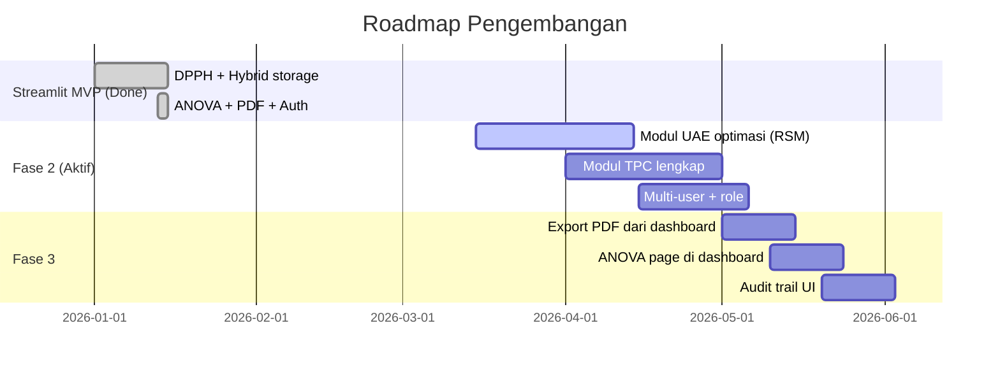

<!-- markdownlint-disable MD033 MD041 -->
<div align="center">

# Platform Digital Evaluasi Antioksidan Daun Salam

**Ekstraksi Berwawasan Lingkungan Daun Salam dengan Metode UAE**
**dan Evaluasi Potensi Antioksidan dalam Platform Digital (Streamlit)**

[](https://www.python.org/)
[](https://streamlit.io/)
[](https://www.google.com/sheets/about/)

[**Streamlit Quick Start**](#mulai-cepat-streamlit) ·
[**Setup Google Sheets**](#setup-google-sheets) ·
[**Panduan Pengguna**](PANDUAN.md)

</div>

---

## Pengantar

Repo ini berfokus pada aplikasi Streamlit untuk membantu penelitian ekstraksi daun salam (UAE) dan pengujian aktivitas antioksidan metode **DPPH**. Aplikasi menyediakan fitur input cepat, perhitungan % inhibisi & IC50, visualisasi, analisis statistik (ANOVA + Tukey), dan generator laporan PDF. Backend primernya adalah Google Sheets (hybrid storage: Google Sheets atau fallback CSV lokal).

### Mengapa Platform Ini

| Tantangan Riset | Solusi Streamlit |
|---|---|
| Hitungan manual % inhibisi & IC50 di Excel rawan typo | Input mentah → otomatis hitung dengan rumus tervalidasi |
| Replikasi data antar laptop & lab | Google Sheets sebagai single source of truth |
| Pembimbing minta uji beda nyata (ANOVA + Tukey) | Modul terintegrasi dengan interpretasi otomatis |
| Lampiran tesis butuh laporan rapi per percobaan | Generator PDF satu klik |
| Akses dari HP saat di lab | Layout responsif, sidebar otomatis collapse |
| Streamlit Cloud auto-sleep setelah 7 hari | GitHub Actions ping setiap 6 jam |

---

## Daftar Isi

1. [Fitur Streamlit](#fitur-streamlit)
2. [Mulai Cepat (Streamlit)](#mulai-cepat-streamlit)
3. [Setup Google Sheets](#setup-google-sheets)
4. [Auth Login](#auth-login)
5. [Modul ANOVA + Tukey HSD](#modul-anova--tukey-hsd)
6. [Export PDF Report](#export-pdf-report)
7. [Deploy ke Streamlit Community Cloud](#deploy-ke-streamlit-community-cloud)
8. [Anti Cold-Start](#anti-cold-start)
9. [Responsive (Mobile-Friendly)](#responsive-mobile-friendly)
10. [Rumus & Validasi Saintifik](#rumus--validasi-saintifik)
11. [Struktur Folder Repo](#struktur-folder-repo)
12. [Troubleshooting](#troubleshooting)
13. [Roadmap](#roadmap)

---

## Fitur Streamlit

| Modul | Deskripsi |
|---|---|
| **Input cerdas DPPH** | Form 3 replikasi × 6 konsentrasi, otomatis hitung % inhibisi (metode pairwise blanko), mean, SD, regresi linear, IC50, dan kategori antioksidan |
| **Visualisasi interaktif** | Kurva regresi dengan annotation IC50 + garis 50%, bar chart dengan error bar SD, line chart perbandingan IC50 antar grup |
| **Statistik tesis** | ANOVA satu arah + post-hoc Tukey HSD untuk uji beda nyata antar waktu inkubasi, metode ekstraksi, atau sampel |
| **PDF report** | Generator laporan PDF per percobaan (A4, 2 halaman): metadata, tabel data, kurva regresi high-res, kesimpulan siap kutip |
| **Auth login** | Passcode sederhana via `secrets.toml` untuk gate write operations (timing-attack safe via `hmac.compare_digest`) |
| **CRUD lengkap** | Lihat, edit massal, dan hapus per percobaan langsung dari worksheet |
| **Hybrid storage** | Auto-pilih: Google Sheets jika `secrets.toml` ter-set, fallback ke CSV lokal untuk development |
| **Responsive** | Layout otomatis stack di mobile, sidebar collapse, grafik scroll horizontal |
| **Performance** | Cache 60 detik untuk read, lazy import Plotly, fastReruns, file-watcher off di production |
| **Anti cold-start** | Workflow GitHub Actions ping app tiap 6 jam |
| **Template siap pakai** | File `template_gsheet.xlsx` di root repo bisa langsung di-import ke Google Sheets |

---

## Mulai Cepat (Streamlit)

```powershell
# Clone & masuk folder app
cd app

# Buat virtualenv
python -m venv .venv
.venv\Scripts\Activate.ps1   # PowerShell
# atau: source .venv/bin/activate     (Linux/macOS)

# Install dependencies
pip install -r requirements.txt

# Jalankan
streamlit run Home.py
```

Buka http://localhost:8501. Tanpa konfigurasi, app jalan dalam **mode CSV lokal** (data ke `app/data/*.csv`). Untuk pindah ke Google Sheets, ikuti section [Setup Google Sheets](#setup-google-sheets) di bawah.

> Untuk panduan langkah demi langkah versi non-teknis, baca [PANDUAN.md](PANDUAN.md).

---

## Setup Google Sheets

Total ~10 menit, satu kali setup. Hasil akhir: aplikasi terhubung ke spreadsheet yang dapat diakses multi-device.

### Langkah 1 — Upload Template

`template_gsheet.xlsx` di root repo berisi **5 tab** siap pakai:

| Tab | Isi | Wajib? |
|---|---|:---:|
| `PETUNJUK` | Panduan + flowchart alur visual | Boleh dihapus |
| `KALKULATOR` | Kalkulator self-contained dengan formula GSheet (edit absorbansi → IC50 auto-update) | Boleh dihapus, atau dipakai untuk quick-check |
| `DPPH` | Database long-format untuk aplikasi | **WAJIB** |
| `UAE` | Parameter ekstraksi (placeholder) | **WAJIB** |
| `TPC` | Total fenolik (placeholder) | **WAJIB** |

**Cara upload:**

1. Buka https://sheets.google.com → klik **Blank**
2. Menu **File → Import**
3. Pilih tab **Upload** → drag-drop file `template_gsheet.xlsx`
4. Di dialog "Import file": pilih **Replace spreadsheet** → klik **Import data**
5. Tunggu 5–10 detik. Spreadsheet langsung terisi 5 tab.
6. Rename spreadsheet (mis. `Tesis - Data Antioksidan`)
7. Salin URL spreadsheet — catat `SPREADSHEET_ID`.

### Langkah 2 — Service Account di Google Cloud

Buat service account dan download key JSON (jangan upload ke GitHub publik). Enable Google Sheets API + Google Drive API.

### Langkah 3 — Share Sheet ke Service Account

Share spreadsheet ke `client_email` dari file JSON (akses Editor).

### Langkah 4 — Konfigurasi `secrets.toml`

Copy template `app/.streamlit/secrets.toml.example` → `app/.streamlit/secrets.toml` dan isi field service account + URL spreadsheet.

> PENTING: Field `private_key` harus disalin persis dari JSON dengan karakter `\n` literal dan tetap dalam satu baris antara tanda kutip ganda.

### Langkah 5 — Verifikasi

```powershell
streamlit run Home.py
```

Banner di Home harus berubah jadi: **"Backend penyimpanan: Google Sheets (terhubung)"**.

---

## Auth Login

Gate write operation (input/edit/hapus) dengan passcode sederhana.

```toml
# app/.streamlit/secrets.toml
[auth]
enabled = true
passcode = "ganti-passcode-rahasia-lo"
label    = "Peneliti"
```

Behaviour:

- Halaman **view** (Home, Visualisasi, ANOVA) tetap dapat diakses tanpa login
- Tombol **Simpan / Hapus** disabled sampai passcode benar
- Form login muncul di sidebar, validasi pakai `hmac.compare_digest`
- Hapus section `[auth]` atau set `enabled = false` untuk menonaktifkan

---

## Modul ANOVA + Tukey HSD

Halaman **Analisis ANOVA** (`pages/6_Analisis_ANOVA.py`) untuk uji beda nyata secara statistik.

Pipeline:

1. **Statistik deskriptif per grup** — n, mean, SD, SEM, min, max
2. **Boxplot** dengan strip plot semua titik
3. **ANOVA satu arah** (`scipy.stats.f_oneway`) — F-statistic, p-value, df, interpretasi otomatis
4. **Post-hoc Tukey HSD** (`statsmodels.stats.multicomp.pairwise_tukeyhsd`) — pasangan mana yang berbeda nyata
5. **Download CSV** hasil lengkap (deskriptif + ANOVA + Tukey)

---

## Export PDF Report

Generator PDF per percobaan untuk **lampiran tesis** atau dokumentasi internal.

**Trigger:** halaman Visualisasi DPPH → pilih `experiment_id` → **Generate Laporan PDF** → **Download**.

Isi (A4, 2 halaman):

1. Header — judul, identitas riset
2. Metadata table — experiment_id, tanggal, sampel, metode, waktu inkubasi, IC50, kategori, R-squared, persamaan, catatan
3. Data table — 10 kolom (konsentrasi, abs 1/2/3, abs mean, % inhibisi 1/2/3, mean, SD)
4. Kurva regresi — high-res PNG via Plotly + Kaleido
5. Kesimpulan — kalimat siap kutip
6. Footer

---

## Deploy ke Streamlit Community Cloud

1. Push repo ke GitHub. Pastikan `secrets.toml` **TIDAK** ke-push (sudah di `.gitignore`).
2. Buka https://share.streamlit.io → **New app**
3. Konfigurasi:
   - Repository: `username/repo`
   - Branch: `main`
   - Main file path: `app/Home.py`
4. **Advanced settings → Secrets**: paste isi `secrets.toml`
5. Deploy. Build pertama 1–3 menit.

---

## Anti Cold-Start

Streamlit Community Cloud men-sleep app yang tidak diakses ~7 hari. Solusi: GitHub Actions cron yang men-ping app tiap 6 jam (workflow `/.github/workflows/keep-alive.yml`).

Test manual:

```powershell
python app/keep_alive.py https://your-app.streamlit.app
# [WARM] https://... (0.42s) HTTP 200: ok
```

---

## Responsive (Mobile-Friendly)

Tested viewport: **360px** (HP kecil), **768px** (tablet), **1280px+** (desktop).

| Behaviour | Implementasi |
|---|---|
| Kolom auto-stack di < 640px | Custom CSS di `utils/ui.py` |
| Sidebar collapse otomatis | `initial_sidebar_state="auto"` |
| Tabel & chart full-width | `use_container_width=True` |
| Plotly scroll horizontal | CSS `overflow-x: auto` |
| Button full-width di mobile | CSS `width: 100%` saat layar kecil |
| Layout default `wide` | Hemat ruang di desktop |

---

## Rumus & Validasi Saintifik

```text
Metode pairwise (default, sesuai praktik lab umum):
    inhib_i = (Abs_blanko_i - Abs_sampel_i) / Abs_blanko_i × 100

Regresi linear:
    y = a · x + b      (x = ppm, y = % inhibisi rata-rata)

IC50:
    IC50 = (50 - b) / a   ppm
```

**Klasifikasi (Molyneux 2004; Blois 1958):**

| IC50 (ppm) | Kategori |
|---:|---|
| < 50 | Sangat kuat |
| 50 – 100 | Kuat |
| 100 – 150 | Sedang |
| 150 – 200 | Lemah |
| > 200 | Sangat lemah |

---

## Struktur Folder Repo

```text
.
├── app/                                # STACK: Streamlit + Google Sheets
│   ├── Home.py                         # Landing + dashboard
│   ├── pages/
│   │   ├── 1_Input_DPPH.py
│   │   ├── 2_Visualisasi_DPPH.py       # + tombol export PDF
│   │   ├── 3_Riwayat_Data.py
│   │   ├── 4_Input_UAE.py
│   │   ├── 5_Input_TPC.py
│   │   └── 6_Analisis_ANOVA.py
│   ├── utils/
│   │   ├── calculations.py             # %inhibisi, regresi, IC50, ANOVA
│   │   ├── sheets.py                   # Wrapper Google Sheets
│   │   ├── local_store.py              # Wrapper CSV (fallback)
│   │   ├── storage.py                  # Facade auto-pilih backend
│   │   ├── cache.py                    # @st.cache_data layer
│   │   ├── ui.py                       # Responsive CSS
│   │   ├── auth.py                     # Passcode gate
│   │   └── pdf_report.py               # Generator PDF
│   ├── tests/
│   │   ├── verify_with_excel.py
│   │   ├── build_template.py
│   │   └── setup_gsheets.py
│   ├── .streamlit/
│   │   ├── config.toml
│   │   └── secrets.toml.example
│   ├── keep_alive.py
│   └── requirements.txt
│
├── .github/workflows/
│   └── keep-alive.yml                  # Cron 6 jam (Streamlit Cloud)
│
├── docs/
│   └── DIAGRAMS.md                     # Diagram Mermaid
│
├── template_gsheet.xlsx                # Template upload Google Sheets (Streamlit)
├── PANDUAN.md                          # Panduan untuk orang awam
└── README.md                           # File ini
```

---

## Troubleshooting

<details>
<summary><b>Banner masih "CSV Lokal" padahal sudah isi <code>secrets.toml</code></b></summary>

- Pastikan path: `app/.streamlit/secrets.toml` (bukan di root repo)
- Section header persis `[connections.gsheets]` (huruf kecil)
- Restart `streamlit run Home.py`
- Toggle "Mode lokal (CSV)" di Home — pastikan tidak aktif

</details>

<details>
<summary><b>Error <code>APIError: invalid_grant</code> atau <code>403 Forbidden</code></b></summary>

- Lupa share Google Sheet ke email service account → ulang Langkah 3
- Pastikan akses **Editor** (bukan Viewer/Commenter)
- Pastikan **Google Sheets API** & **Google Drive API** sudah enabled

</details>

<details>
<summary><b>Error <code>private_key</code> malformed</b></summary>

- Saat menyalin dari JSON, pertahankan karakter `\\n` literal (jangan ganti dengan baris baru)
- Pastikan dikutip ganda `"..."`, bukan single quote
- Di Streamlit Cloud "Secrets", tempel format TOML asli (sama dengan file lokal)

</details>

<details>
<summary><b>Worksheet tab tidak ditemukan</b></summary>

- Tab harus bernama persis `DPPH`, `UAE`, `TPC` (case-sensitive)
- Tab default `Sheet1` tidak dipakai

</details>

<details>
<summary><b>App lambat di akses pertama (cold start)</b></summary>

- Normal kalau app baru deploy ulang atau lebih dari 7 hari tidak diakses
- Aktifkan keep-alive workflow (lihat [Anti Cold-Start](#anti-cold-start))
- Setelah cold start pertama, akses berikutnya instan karena cache 60 detik

</details>

<details>
<summary><b>Mobile: chart Plotly terpotong</b></summary>

- Geser horizontal di area chart (overflow-x: auto)
- Atau rotate HP ke landscape

</details>

<details>
<summary><b>Data hilang setelah refresh di Streamlit Cloud</b></summary>

- Mode CSV Lokal di Streamlit Cloud tidak persisten (filesystem ephemeral)
- Pindah ke Google Sheets

</details>

<details>
<summary><b>PDF tidak ada chart-nya</b></summary>

- Pastikan `kaleido` ter-install: `pip install kaleido`
- Restart streamlit

</details>

---

## Roadmap



---

## Lisensi & Atribusi

Platform akademik untuk keperluan tesis Magister Studi Lingkungan UNTIRTA. Library third-party tunduk pada lisensi masing-masing.

[Streamlit](https://streamlit.io/) ·
[pandas](https://pandas.pydata.org/) ·
[scipy](https://scipy.org/) ·
[statsmodels](https://www.statsmodels.org/) ·
[Plotly](https://plotly.com/python/) ·
[ReportLab](https://www.reportlab.com/) ·
[gspread](https://docs.gspread.org/) via
[streamlit-gsheets-connection](https://github.com/streamlit/gsheets-connection)

---

<div align="center">

**Made for Magister Studi Lingkungan, Pascasarjana UNTIRTA**

[Streamlit Quick Start](#mulai-cepat-streamlit) ·
[Diagram](docs/DIAGRAMS.md) ·
[Panduan Awam](PANDUAN.md)

</div>
