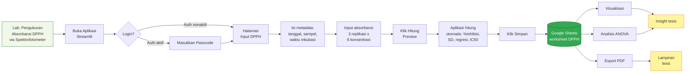
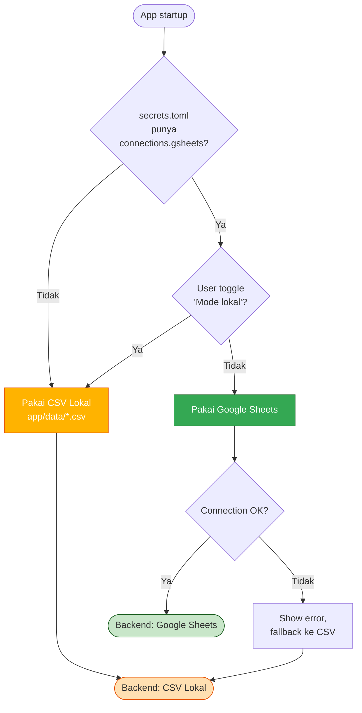
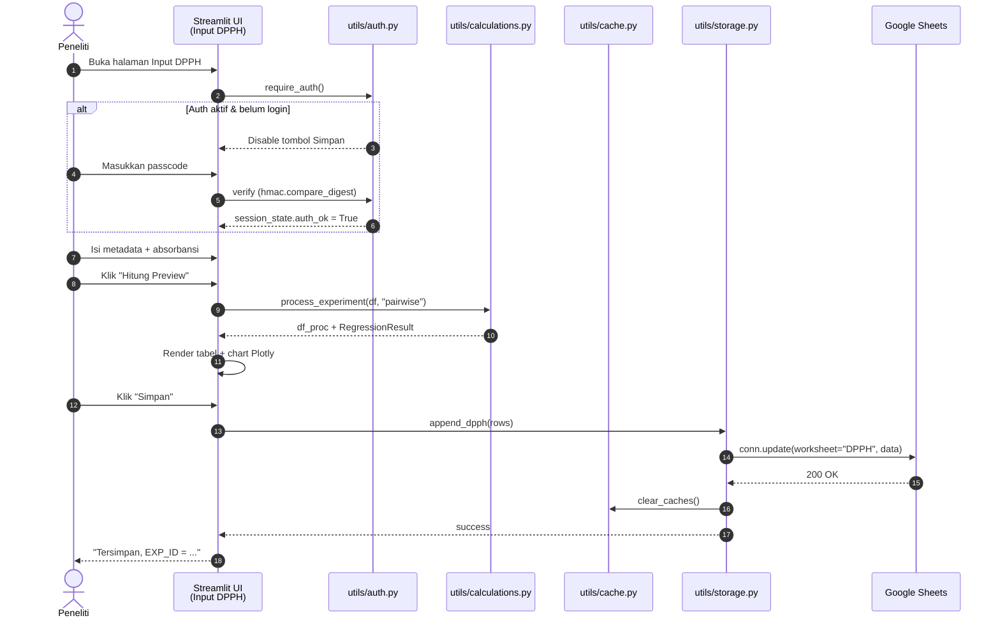
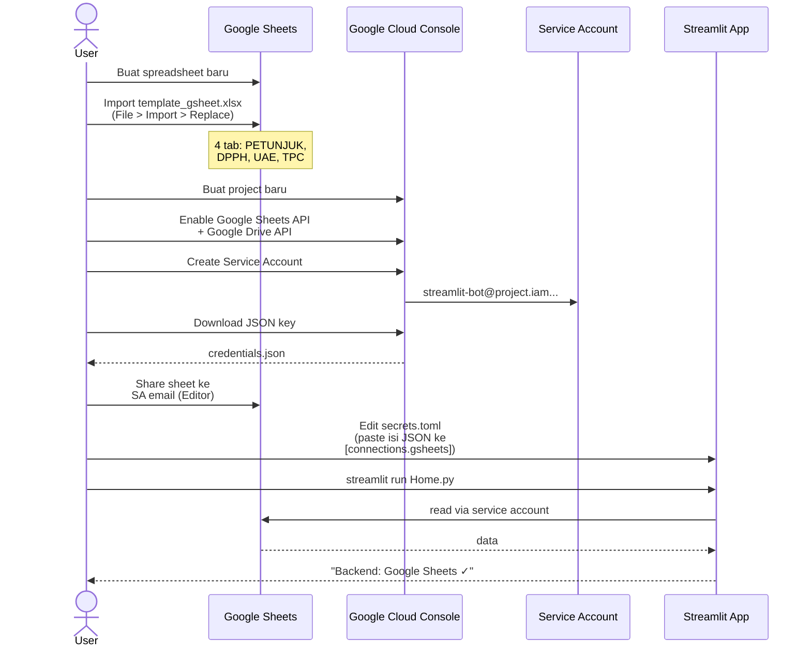
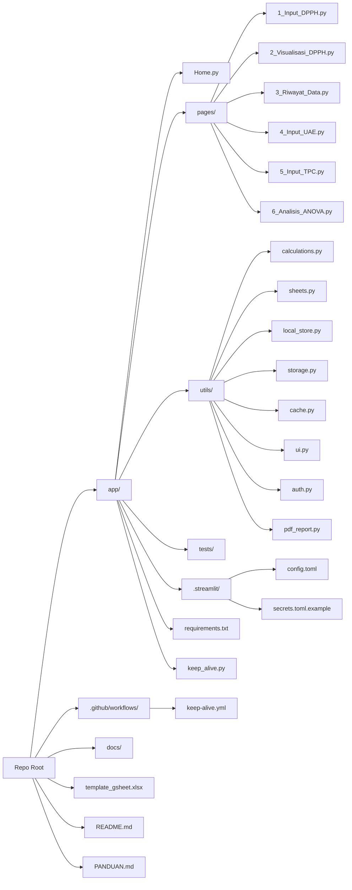
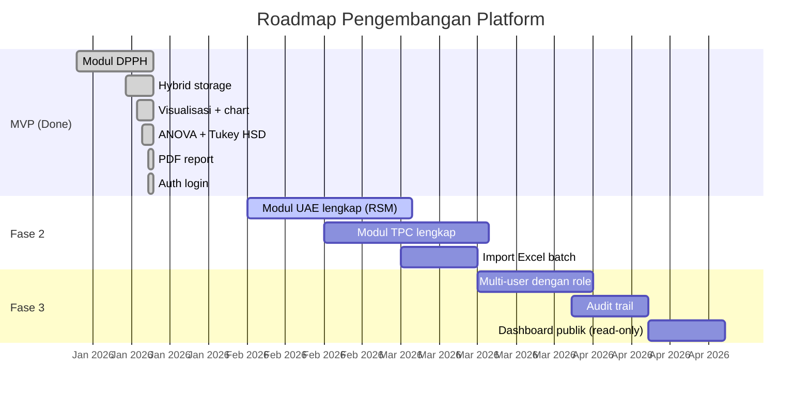

# Diagram & Visual Reference

Kumpulan diagram Mermaid untuk dokumentasi platform.
GitHub & VS Code dapat me-render Mermaid secara native; tidak perlu tooling tambahan.

## Daftar Diagram

1. [Alur Kerja Riset (User Journey)](#1-alur-kerja-riset-user-journey)
2. [Arsitektur Sistem](#2-arsitektur-sistem)
3. [Decision Tree Backend](#3-decision-tree-backend-storage)
4. [Sequence: Input Data DPPH](#4-sequence-input-data-dpph)
5. [Sequence: Setup Google Sheets](#5-sequence-setup-google-sheets)
6. [Flow Auth Login](#6-flow-auth-login)
7. [Pipeline Perhitungan DPPH](#7-pipeline-perhitungan-dpph)
8. [Anti Cold-Start Mechanism](#8-anti-cold-start-mechanism)
9. [Struktur Folder](#9-struktur-folder)
10. [Roadmap Modul](#10-roadmap-modul)

---

## 1. Alur Kerja Riset (User Journey)



---

## 2. Arsitektur Sistem

```mermaid
flowchart TB
    subgraph Browser["Browser / Mobile"]
        UI[Streamlit UI]
    end

    subgraph App["Streamlit App (Python)"]
        H[Home.py]
        P1[Input DPPH]
        P2[Visualisasi]
        P3[Riwayat]
        P4[Input UAE]
        P5[Input TPC]
        P6[ANOVA]

        subgraph Utils["utils/"]
            CALC[calculations.py<br/>%inhibisi, IC50,<br/>ANOVA, Tukey]
            STO[storage.py<br/>facade]
            SHE[sheets.py<br/>gsheets wrapper]
            LOC[local_store.py<br/>CSV fallback]
            CACHE[cache.py<br/>@st.cache_data]
            UI_H[ui.py<br/>responsive CSS]
            AUTH[auth.py<br/>passcode gate]
            PDF[pdf_report.py<br/>reportlab]
        end
    end

    subgraph Backend["Backend (auto-pilih)"]
        GS[(Google Sheets<br/>via service account)]
        FS[(CSV lokal<br/>app/data/)]
    end

    UI <-->|HTTP| H
    H --> P1 & P2 & P3 & P4 & P5 & P6
    P1 & P3 & P4 & P5 --> AUTH
    P1 & P2 & P3 & P4 & P5 & P6 --> CACHE
    CACHE --> STO
    STO -->|secrets ada| SHE
    STO -->|fallback| LOC
    SHE --> GS
    LOC --> FS
    P1 & P2 --> CALC
    P6 --> CALC
    P2 --> PDF
    H & P1 & P2 & P3 & P4 & P5 & P6 --> UI_H

    style GS fill:#34A853,stroke:#1B5E20,color:#fff
    style FS fill:#FFB300,stroke:#E65100,color:#fff
    style AUTH fill:#FF7043,stroke:#BF360C,color:#fff
```

---

## 3. Decision Tree Backend Storage



---

## 4. Sequence: Input Data DPPH



---

## 5. Sequence: Setup Google Sheets



---

## 6. Flow Auth Login

```mermaid
flowchart TD
    Start([User akses page]) --> A{[auth] section di<br/>secrets.toml &<br/>enabled=true?}
    A -->|Tidak| FREE[Auth dimatikan,<br/>semua bisa input]
    A -->|Ya| B{session_state<br/>auth_ok = True?}
    B -->|Ya| LOGGED[User sudah login,<br/>tampilkan Logout button]
    B -->|Tidak| LOGIN[Tampilkan form login<br/>di sidebar]
    LOGIN --> INP[User isi passcode]
    INP --> CHK{hmac.compare_digest<br/>cocok?}
    CHK -->|Ya| SET[set session_state<br/>auth_ok = True]
    CHK -->|Tidak| ERR[Tampilkan<br/>'Passcode salah']
    ERR --> LOGIN
    SET --> LOGGED
    FREE --> RENDER([Render page +<br/>tombol Simpan aktif])
    LOGGED --> RENDER
    LOGIN --> RENDERD([Render page +<br/>tombol Simpan DISABLED])

    style FREE fill:#FFE0B2,stroke:#E65100
    style LOGGED fill:#C8E6C9,stroke:#1B5E20
    style RENDERD fill:#FFCDD2,stroke:#B71C1C
```

---

## 7. Pipeline Perhitungan DPPH

```mermaid
flowchart LR
    Input[df_raw:<br/>konsentrasi,<br/>abs_1, abs_2, abs_3] --> A[Sort by konsentrasi]
    A --> B[Hitung abs_mean<br/>per row]
    B --> C{Konsentrasi == 0<br/>blanko?}
    C -->|Ya| D[inhib_* = NaN]
    C -->|Tidak| E[Pairwise inhibisi:<br/>inhib_i = abs_b_i - abs_s_i / abs_b_i x 100]
    E --> F[Hitung inhib_mean<br/>+ inhib_sd ddof=1]
    D --> G[Concat ke df_proc]
    F --> G
    G --> H[Linear regression<br/>scipy.stats.linregress]
    H --> I[a = slope<br/>b = intercept<br/>R² = rvalue²]
    I --> J[IC50 = 50 - b / a]
    J --> K[classify_ic50<br/>Molyneux 2004]
    K --> Output[df_proc + RegressionResult<br/>+ IC50 + kategori]

    style Input fill:#E3F2FD,stroke:#0D47A1
    style Output fill:#C8E6C9,stroke:#1B5E20
    style E fill:#FFF59D,stroke:#F57F17
    style J fill:#FFF59D,stroke:#F57F17
```



---

## 8. Anti Cold-Start Mechanism

```mermaid
flowchart TB
    subgraph Layer1["Layer 1: Caching"]
        A1[Read DPPH/UAE/TPC] --> A2[@st.cache_data<br/>ttl=60s]
        A2 --> A3[Cache hit:<br/>< 50ms]
        A2 --> A4[Cache miss:<br/>baca gsheets]
    end

    subgraph Layer2["Layer 2: Config"]
        B1[runOnSave=false]
        B2[fileWatcherType=none]
        B3[fastReruns=true]
        B4[Lazy import Plotly]
    end

    subgraph Layer3["Layer 3: Keep-Alive"]
        C1[GitHub Actions cron] -->|tiap 6 jam| C2[ping /_stcore/health]
        C2 --> C3{Status 200?}
        C3 -->|Ya| C4[App tetap warm]
        C3 -->|Tidak| C5[Wake up app]
    end

    Cold[Cold start: 30-60s] --> Warm
    Warm[App warm < 1s] --> User([User akses cepat])

    Layer1 -.-> Warm
    Layer2 -.-> Warm
    Layer3 -.-> Warm

    style Cold fill:#FFCDD2,stroke:#B71C1C
    style Warm fill:#C8E6C9,stroke:#1B5E20
```

---

## 9. Struktur Folder



---

## 10. Roadmap Modul



---

> Tip: untuk preview Mermaid lokal di VS Code, install ekstensi
> [Markdown Preview Mermaid Support](https://marketplace.visualstudio.com/items?itemName=bierner.markdown-mermaid).
